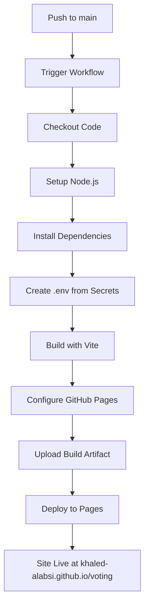

# GitHub Actions Workflow Documentation

## 🎯 Overview

This document explains how the GitHub Actions CI/CD pipeline works for the VotingApp, including workflow configuration, permissions, and deployment process.

## 📁 File Location

**File**: `.github/workflows/deploy.yml`

## 🔧 Workflow Configuration

### Trigger Events

```yaml
on:
  push:
    branches: [ main ]
  pull_request:
    branches: [ main ]
```

**When the workflow runs:**
- ✅ On every push to the `main` branch
- ✅ On pull requests targeting the `main` branch
- ❌ Manual triggers (not configured)

### Permissions

```yaml
permissions:
  contents: read
  pages: write
  id-token: write
```

**Why these permissions are needed:**
- `contents: read` - Read repository files and code
- `pages: write` - Deploy to GitHub Pages
- `id-token: write` - Use OIDC tokens for secure authentication

## 🏗️ Pipeline Steps

### 1. Environment Setup

```yaml
- name: Checkout
  uses: actions/checkout@v4

- name: Setup Node.js
  uses: actions/setup-node@v4
  with:
    node-version: '18'
    cache: 'npm'
```

**What happens:**
- Downloads repository code
- Sets up Node.js version 18
- Enables npm package caching for faster builds

### 2. Dependency Installation

```yaml
- name: Install dependencies
  run: npm ci
```

**Why `npm ci` instead of `npm install`:**
- ✅ Faster and more reliable in CI environments
- ✅ Uses exact versions from `package-lock.json`
- ✅ Doesn't modify lock file
- ✅ Clean install (removes node_modules first)

### 3. Environment Configuration

```yaml
- name: Create environment file
  run: |
    echo "VITE_FIREBASE_API_KEY=${{ secrets.REACT_APP_FIREBASE_API_KEY }}" >> .env
    echo "VITE_FIREBASE_AUTH_DOMAIN=${{ secrets.REACT_APP_FIREBASE_AUTH_DOMAIN }}" >> .env
    # ... more environment variables
```

**Process:**
1. Creates `.env` file in the build environment
2. Populates with Firebase configuration from GitHub Secrets
3. Uses Vite naming convention (`VITE_` prefix)

### 4. Build Process

```yaml
- name: Build
  run: npm run build
```

**Build outputs:**
- Generates optimized production files in `./dist/`
- Applies base URL configuration for GitHub Pages (`/voting/`)
- Minifies JavaScript, CSS, and optimizes assets

### 5. GitHub Pages Deployment

```yaml
- name: Setup Pages
  uses: actions/configure-pages@v4

- name: Upload artifact
  uses: actions/upload-pages-artifact@v3
  with:
    path: './dist'

- name: Deploy to GitHub Pages
  uses: actions/deploy-pages@v4
```

**Deployment process:**
1. **Configure Pages**: Prepares GitHub Pages environment
2. **Upload Artifact**: Packages `./dist/` folder as deployment artifact
3. **Deploy**: Publishes artifact to GitHub Pages

## 🔐 Secret Management

### Required Secrets

All secrets must be configured in repository settings (`Settings` → `Secrets and variables` → `Actions`):

| Secret Name | Description | Example Value |
|------------|-------------|---------------|
| `REACT_APP_FIREBASE_API_KEY` | Firebase Web API Key | `AIzaSyC...` |
| `REACT_APP_FIREBASE_AUTH_DOMAIN` | Firebase Auth Domain | `voting-946b7.firebaseapp.com` |
| `REACT_APP_FIREBASE_PROJECT_ID` | Firebase Project ID | `voting-946b7` |
| `REACT_APP_FIREBASE_STORAGE_BUCKET` | Firebase Storage Bucket | `voting-946b7.appspot.com` |
| `REACT_APP_FIREBASE_MESSAGING_SENDER_ID` | FCM Sender ID | `123456789` |
| `REACT_APP_FIREBASE_APP_ID` | Firebase App ID | `1:123:web:abc` |
| `REACT_APP_FIREBASE_MEASUREMENT_ID` | Analytics Measurement ID | `G-XXXXXXXXXX` |

### Secret Security

**How secrets are protected:**
- 🔒 Encrypted at rest in GitHub
- 🔒 Only accessible during workflow execution
- 🔒 Not visible in logs or build output
- 🔒 Automatically redacted if accidentally logged

## 🚀 Deployment Flow



## ⏱️ Performance

**Typical execution times:**
- Dependencies installation: ~30-60 seconds
- Build process: ~30-45 seconds
- Deployment: ~10-15 seconds
- **Total: ~2-3 minutes**

**Optimization strategies:**
- ✅ npm caching enabled
- ✅ Efficient action versions used
- ✅ Minimal dependency installation with `npm ci`

## 🔧 Troubleshooting

### Common Issues

**1. Permissions Error (403)**
```
remote: Permission to khaled-alabsi/voting.git denied
```
**Solution**: Ensure GitHub Pages source is set to "GitHub Actions"

**2. Deprecated Actions**
```
Error: uses a deprecated version of actions/upload-artifact
```
**Solution**: Update action versions in workflow file

**3. Build Failures**
```
npm ERR! code ELIFECYCLE
```
**Solution**: Check package.json scripts and dependencies

**4. Missing Secrets**
```
undefined is not a valid Firebase config
```
**Solution**: Verify all Firebase secrets are configured

### Debug Commands

**Check workflow status:**
```bash
# View workflow runs
git log --oneline
```

**Local build test:**
```bash
# Test build locally
npm run build
npm run preview
```

## 🔄 Updating the Workflow

### Action Version Updates

**To update action versions:**
1. Check [GitHub Actions Marketplace](https://github.com/marketplace?type=actions)
2. Update version numbers in `.github/workflows/deploy.yml`
3. Test with a pull request first

**Current action versions:**
- `actions/checkout@v4`
- `actions/setup-node@v4`
- `actions/configure-pages@v4`
- `actions/upload-pages-artifact@v3`
- `actions/deploy-pages@v4`

### Adding New Build Steps

**Example: Adding linting:**
```yaml
- name: Lint code
  run: npm run lint

- name: Type check
  run: npm run type-check
```

**Example: Adding tests:**
```yaml
- name: Run tests
  run: npm test
```

## 📊 Monitoring

**View deployment status:**
1. Go to repository → `Actions` tab
2. View workflow runs and logs
3. Check deployment status in `Settings` → `Pages`

**Deployment URL:**
- Production: `https://khaled-alabsi.github.io/voting/`
- Status: Available in repository `Environments` section